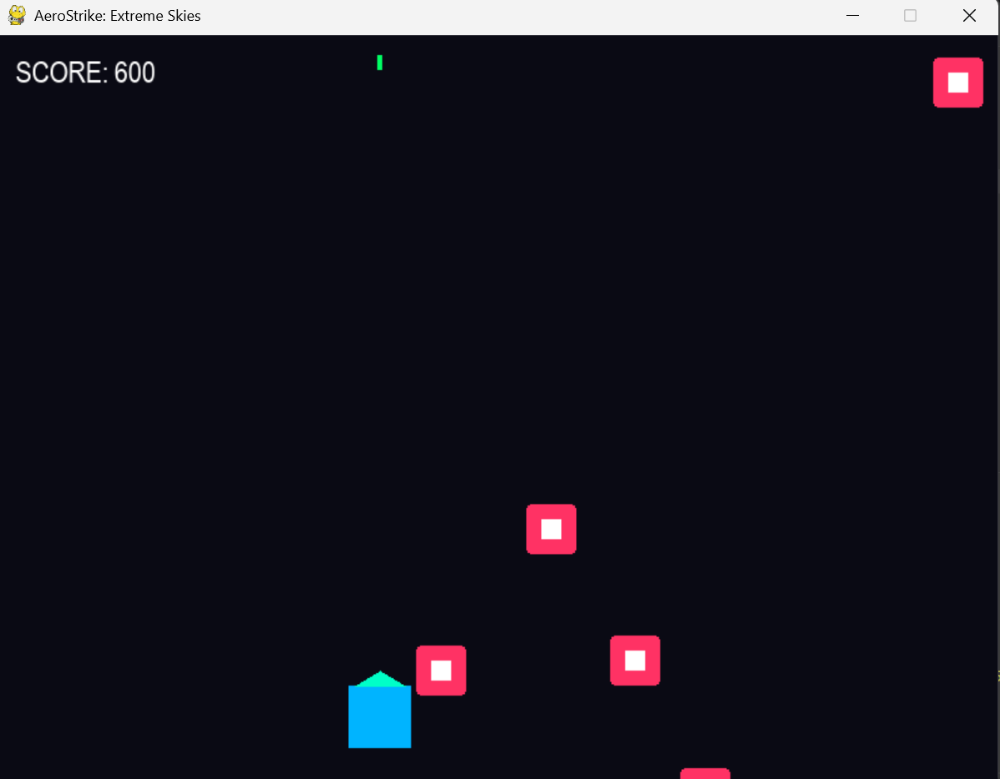
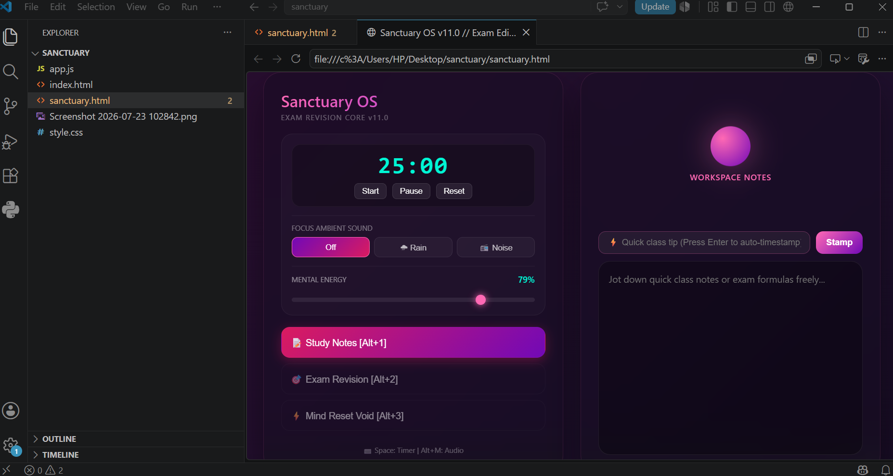

# 1. 3D Cyberpunk Physics Engine (projectile_sim.py)
A continuous numerical solver for ballistics.

# Physics: Computes gravitational pull (g) integrated with aerodynamic drag coefficients (C_d).

# Functionality: Real-time telemetry sliders for velocity, pitch, and yaw.

# Utility: Scalable to drone path planning and high-resistance trajectory modeling.

# 2. AeroBallistics-2D

A real-time 2D physics engine simulating projectile trajectories under the influence of air resistance, gravity, and spin curve mechanics.

# The Science Behind the Engine

The engine calculates forces frame-by-frame based on real-world fluid dynamics scale where 110 pixels equals 1 meter.

# 1. Aerodynamic Drag
This accounts for air resistance pushing against the ball as it travels forward. It uses standard air density (1.225 kg/m3) and a realistic sphere drag coefficient (0.45) to slow the ball down naturally over time.

# 2. Magnus Effect (Spin Curve)
This generates a lift or dipping force perpendicular to the direction of travel based on how fast the ball is spinning. The rotational spin rate drives both the visual roll of the ball and its physics path.

---

 Presets Built into the Code

* Press [1] Knuckleball: High velocity, zero spin, pure drag drop.
* Press [2] Inside Curve: Top and side-spin blend creating an aggressive late dip into the net.
* Press [3] Trivela: Reverse spin mechanics causing an opposite aerodynamic break.

 Tech Stack
* Language: Python 3
* Library: Pygame

# AeroStrike: Extreme Skies 

A high-performance 2D arcade space shooter engine built from scratch using Python and Pygame. This project serves as an implementation study of systems programming, modular software architecture, and real-time physics decoupling.

 # Core Engineering Features

1. Delta-Time Physics Consistent Engine (60FPS): Decoupled frame-rate rendering from physics calculations. This ensures identical entity velocity, laser trajectories, and gameplay mechanics across varying CPU hardware configurations.

2. Modular Software Architecture: Refactored a monolithic script into standalone, decoupled runtime subsystems (e.g., dedicated audio initialization modules) to lower global memory overhead and maximize debugging scalability.

3. Advanced Kinematics & Sinusoidal Path Variables: Programmed autonomous enemy entities utilizing trigonometric waves (`math.sin`) to generate complex, fluid horizontal swaying vectors during vertical descent.

5. Robust Collision Detection (AABB): Implemented precise Axis-Aligned Bounding Box collision matrices to track intersection vectors between high-velocity laser arrays and active enemy matrices.

# Core Technology Stack

Programming Language: Python 3.11+ — Leveraged for clean, high-level object-oriented engine architecture and rapid implementation of math matrices.

Graphics Engine Framework: Pygame CE (Community Edition) — Used to manage the low-level multimedia hardware layer, window rendering, and real-time input matrices.

Version Control Architecture: Git & GitHub — Utilized for continuous integration, managing codebase refactoring, and tracking deployment history with professional commit standards.

# Mathematical Systems Used

Vector Kinematics & Linear Algebra: Standard coordinate geometry used for velocity vector tracking and particle systems.

 
Trigonometric & Non-Linear Functions: Utilized math.sin(), math.cos(), and natural constants like Euler's number (e via math.exp) to calculate coordinate-space shifts and real-time kinetic impact impulses.

# Sanctuary

Why this project?: This has been a recent project of mine and i did this to support or help out people in depression, anxiety or stress. The project is still under work as it has to be more optimised but i added things like pomodoro timer, taks organizer, calm sound effects and a stress reducer option too! 

